# Synapse MAS — Arquitectura ArchiMate por Capas

Este documento presenta la arquitectura del sistema **Synapse MAS** (Sistema Multi-Agente RAG Multimodal para Elevadores Schindler) utilizando el marco de trabajo ArchiMate.

## Diagrama de Arquitectura (HD)

```mermaid
graph TD
    %% Base Styles for ArchiMate Notation
    classDef business fill:#FFF9C4,stroke:#FBC02D,color:#333
    classDef application fill:#B2EBF2,stroke:#00ACC1,color:#333
    classDef data fill:#BBDEFB,stroke:#1976D2,color:#333
    classDef technology fill:#C8E6C9,stroke:#388E3C,color:#333
    classDef grouping fill:#f9f9f9,stroke:#ddd,stroke-dasharray: 5 5,color:#666

    subgraph BUSINESS_LAYER [① BUSINESS LAYER — Capa de Presentación]
        direction TB
        subgraph BUS_ROW_1 [ ]
            direction LR
            ACTOR["👤 Técnico / Ingeniero<br/>(Business Actor)"]:::business
            ROLE_ADMIN["👔 Administrador<br/>(Business Role)"]:::business
        end
        subgraph BUS_ROW_2 [ ]
            direction LR
            SERV_AUTH["🔐 Autenticación<br/>(Business Service)"]:::business
            INT_DASH["📊 Dashboard Web<br/>(Business Interface)"]:::business
        end
        subgraph BUS_ROW_3 [ ]
            direction LR
            PROC_DL["📋 Consulta de Diagnóstico<br/>(Business Process)"]:::business
            PROC_IDX["📤 Indexación de Documentos<br/>(Business Process)"]:::business
        end
    end

    subgraph APPLICATION_LAYER [② APPLICATION LAYER — Capa de Aplicación]
        direction TB
        
        subgraph APP_ROW_1 [ ]
            direction LR
            CORE["⚙️ Synapse MAS Core<br/>(Application Component)"]:::application
            subgraph AGENTS_STAGED [Componentes Staged]
                direction TB
                FIDELITY["🛡️ Verificador de Fidelidad"]:::application
                SELECTOR["🗺️ Selector de Contexto"]:::application
                ROUTER["⚡ Enrutador Semántico"]:::application
            end
        end
        
        subgraph APP_ROW_2 [ ]
            direction LR
            subgraph PIPE_RAG [Pipeline RAG / Indexing]
                direction TB
                ORCH["🎯 Orchestrator"]:::application
                OCR["📖 OCR"]:::application
                VIS["👁️ Vision"]:::application
            end

            subgraph PIPE_CHAT [Pipeline Chat — Agentic Loop]
                direction TB
                CLAR["🔤 Clarificador"]:::application
                PLAN["📋 Planificador"]:::application
                ANAL["🔬 Analista"]:::application
            end
        end

        subgraph APP_ROW_3 [ ]
            direction LR
            SERV_CHAT["💬 Servicio de Chat RAG"]:::application
            SERV_IDX["🔂 Servicio de Indexación"]:::application
        end

        subgraph APP_ROW_4 [ ]
            direction LR
            CURIOUS["🤔 Agente Curious — HITL"]:::application
            LOGGER["📈 Logger + FinOps"]:::application
        end
    end

    subgraph DATA_LAYER [③ DATA LAYER — Capa de Datos]
        direction TB
        subgraph DATA_ROW_1 [ ]
            direction LR
            ART_PDF["📄 PDFs + Imágenes Procesadas<br/>(Artifact)"]:::data
            DO_CHUNKS["📦 Chunks + Embeddings<br/>(Data Object)"]:::data
        end
        subgraph DATA_ROW_2 [ ]
            direction LR
            DO_IMGS["🖼️ Imágenes + Embeddings<br/>(Data Object)"]:::data
            DO_SESS["💬 Chat Sessions + Messages<br/>(Data Object)"]:::data
        end
        subgraph DATA_ROW_3 [ ]
            direction LR
            DO_ENR["💡 Enrichments — HITL<br/>(Data Object)"]:::data
            DO_METRICS["📊 Agent Logs + Métricas<br/>(Data Object)"]:::data
        end
    end

    subgraph TECH_LAYER [④ TECHNOLOGY LAYER — Capa de Tecnología]
        direction TB
        subgraph TECH_ROW_1 [ ]
            direction LR
            MISTRAL["☁️ Mistral AI API"]:::technology
            OPENAI["☁️ OpenAI API"]:::technology
        end
        subgraph TECH_ROW_2 [ ]
            direction LR
            R2["🪣 Cloudflare R2"]:::technology
            NEXT["⚛️ Next.js 16.2.1 + Vercel AI SDK"]:::technology
        end
        subgraph TECH_ROW_3 [ ]
            direction LR
            VERCEL["⚡ Vercel Serverless"]:::technology
            TURSO["🗄️ Turso Cloud — LibSQL"]:::technology
        end
    end

    %% Relationships
    ACTOR -- "triggering" --> PROC_DL
    ROLE_ADMIN -- "triggering" --> PROC_IDX
    INT_DASH -- "serving" --> ROLE_ADMIN
    
    PROC_DL -- "uses" --> SERV_CHAT
    PROC_IDX -- "uses" --> SERV_IDX
    
    SERV_CHAT -- "realization" --> PIPE_CHAT
    SERV_IDX -- "realization" --> PIPE_RAG
    
    PIPE_CHAT -- "reads" --> DO_SESS
    PIPE_CHAT -- "reads" --> DO_CHUNKS
    PIPE_CHAT -- "reads" --> DO_ENR
    
    PIPE_RAG -- "writes" --> DO_CHUNKS
    PIPE_RAG -- "writes" --> DO_IMGS
    PIPE_RAG -- "writes" --> ART_PDF
    
    CURIOUS -- "writes" --> DO_ENR
    LOGGER -- "writes" --> DO_METRICS
    
    %% Tech Alignment
    NEXT -- "realizes" --> CORE
    VERCEL -- "hosts" --> NEXT
    TURSO -- "hosts" --> DATA_LAYER
    R2 -- "hosts" --> ART_PDF
    OPENAI -- "serving" --> APPLICATION_LAYER
    MISTRAL -- "serving" --> APPLICATION_LAYER

    %% Legend Approximation
    %% (Relationships match ArchiMate notation)
```

## Leyenda de Colores

- ■ **Capa de Negocio**: Actores, procesos y roles humanos.
- ■ **Capa de Aplicación**: Componentes de software, agentes y funciones lógicas.
- ■ **Capa de Datos**: Estructuras de información persistentes y artefactos.
- ■ **Capa de Tecnología**: Infraestructura cloud, bases de datos y APIs externas.

---
> **Nota:** Este diagrama sustituye a `arquitectura_sistema.png` para propósitos de documentación técnica y alta resolución.
