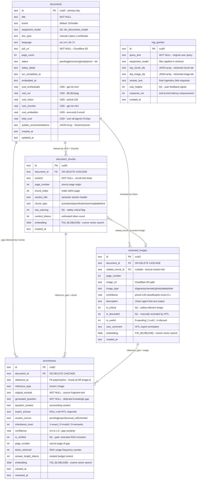

# Diagrama 3 — Base de Datos: Modelo Relacional con Vectores

**Sistema:** Synapse MAS — RAG Multi-Agente para Diagnóstico Técnico de Elevadores Schindler
**Motor:** Turso LibSQL (SQLite-compatible) · `libsql://htl-synapse-ia.turso.io`
**ORM:** Drizzle ORM v0.40 · `lib/db/schema.ts`
**Nivel:** Diseño de datos · Vista de entidades y relaciones
**Apto para:** Presentación en tesis, documentación de modelo de datos

> **Tablas excluidas:** `agent_logs` (observabilidad operacional) · `indexing_metrics` (FinOps por pipeline)

---

## Finalidad

Modelo relacional de las 5 entidades de negocio centrales del sistema. Destaca las columnas `F32_BLOB(1536)` que habilitan la búsqueda vectorial nativa por similitud coseno, el sistema de herencia en cascada de `enrichments` y el ciclo HITL (Human-in-the-Loop) que convierte conocimiento experto en contexto RAG activo.

---

## Diagrama



---

## Descripción por Entidad

### `documents` — Tabla Maestra de Documentos
Registro central de cada PDF técnico procesado. Actúa como raíz de la jerarquía de datos y como registro de estado del pipeline de indexación.

| Grupo de campos | Descripción |
|---|---|
| **Taxonomía** | `brand`, `equipment_model`, `doc_type`, `language` — permiten filtrar el espacio de búsqueda vectorial por modelo de equipo |
| **Storage** | `pdf_url` → path en Cloudflare R2 (`docId/original.pdf`) |
| **Pipeline state** | `status` con índice: `pending → processing → ready → error`. Consultado por polling desde el frontend |
| **FinOps** | `cost_*` por agente y `total_cost` en USD. Actualizados al finalizar cada agente del Enjambre A |
| **Auditor** | `auditor_recommendations` — JSON producido por VectorScanner con observaciones sobre la calidad del índice |

---

### `document_chunks` — Fragmentos de Texto RAG
Resultado de la segmentación semántica del Chunker. Cada registro representa un fragmento de conocimiento técnico con su vector asociado.

| Campo clave | Descripción |
|---|---|
| `chunk_type` | Clasifica el contenido: `procedure` (pasos operativos), `specification` (valores técnicos), `warning` (advertencias de seguridad), `table`, `text` |
| `has_warning` | Flag `1` en chunks con advertencias de seguridad. Permite al Analista priorizar fragmentos críticos |
| `content_tokens` | Estimación de tokens para gestionar el presupuesto de contexto del Ingeniero Jefe |
| `embedding` | `F32_BLOB(1536)` generado por `text-embedding-3-small`. Habilita `vector_distance_cos()` en Turso |

**Índices:** `idx_chunks_document`, `idx_chunks_page`, `idx_chunks_warning`

---

### `extracted_images` — Imágenes Multimodales RAG
Imágenes extraídas por OCR y clasificadas por Vision (pixtral-12b-2409). Incluye el ciclo HITL completo de revisión humana.

| Campo clave | Descripción |
|---|---|
| `image_type` | Clasificación de Vision: `diagram`, `schematic`, `photo`, `table`, `other` |
| `confidence` | Score de certeza de pixtral-12b (0.0–1.0) sobre la clasificación |
| `is_critical` | Imágenes que Vision marca como safety-relevant (circuitos de seguridad, esquemas de emergencia) |
| `is_useful` | Estado HITL: `0=pendiente`, `1=útil`, `-1=descartar`. Controlado desde el EnrichmentReviewer |
| `user_comment` | Anotación libre del técnico experto: "es el diagrama SCIC que controla el frenado" |
| `related_chunk_id` | FK que vincula la imagen al chunk de texto de su misma página para contexto cruzado |
| `embedding` | `F32_BLOB(1536)` generado desde la `description` de Vision. Habilita búsqueda semántica de imágenes |

**Índices:** `idx_images_document`, `idx_images_critical`, `idx_images_type`

---

### `enrichments` — Conocimiento Experto HITL
Tabla central del ciclo Human-in-the-Loop. Almacena las lagunas de conocimiento detectadas por el Curioso y las respuestas de los expertos humanos que enriquecen el RAG.

| Campo clave | Descripción |
|---|---|
| `reference_id` / `reference_type` | Relación polimórfica: apunta a un `document_chunk.id` o `extracted_image.id` según `reference_type` |
| `generated_question` | La laguna detectada por el Curioso: "¿Qué significa el código E407 en el módulo SDIC?" |
| `expert_answer` | `NULL` hasta que el experto responde en el EnrichmentReviewer |
| `answer_source` | Trazabilidad: `pending` (sin responder) → `expert` (respondido) → `inherited` (propagado por herencia) |
| `inheritance_level` | **L1**: misma pregunta exacta en otro doc → hereda respuesta. **L2**: mismo modelo de equipo → hereda. **L3**: similitud semántica vectorial ≤0.25 → hereda. Reduce carga sobre el experto |
| `is_verified` | **Gate de calidad crítico**: solo los enrichments con `is_verified=1` se incluyen en el contexto RAG del Bibliotecario Texto (LEFT JOIN) |
| `times_retrieved` | Contador de veces que el RAG sirvió este enrichment en consultas reales. Permite análisis de utilidad |
| `embedding` | `F32_BLOB(1536)` de la `expert_answer`. Habilita que el Bibliotecario recupere enrichments por similitud semántica |

**Índices:** `idx_enrichments_document`, `idx_enrichments_reference`, `idx_enrichments_pending`

---

### `rag_queries` — Registro de Sesiones RAG
Log de cada consulta completada por el Enjambre B. Base de datos para análisis de calidad, latencia y feedback loop del sistema.

| Campo clave | Descripción |
|---|---|
| `top_chunk_ids` | JSON array con los IDs de los chunks que formaron el `groundTruth` de esa sesión |
| `top_image_ids` | JSON array con los IDs de las imágenes que aportaron `imageContext` |
| `was_helpful` | Señal de feedback del técnico (0/1). Futura base para fine-tuning o reranking |
| `response_ms` | Latencia end-to-end desde la query del técnico hasta el cierre del stream SSE |

---

## Relaciones

| Relación | Cardinalidad | Descripción |
|---|---|---|
| `documents` → `document_chunks` | 1:N | Un documento genera múltiples chunks tras OCR + Chunker |
| `documents` → `extracted_images` | 1:N | Un documento produce múltiples imágenes tras OCR + Vision |
| `documents` → `enrichments` | 1:N | El Curioso genera múltiples lagunas por documento |
| `document_chunks` → `extracted_images` | N:1 (nullable) | `related_chunk_id` vincula imagen con el texto de su misma página |
| `document_chunks` → `enrichments` | 1:N | Un chunk puede tener múltiples lagunas detectadas (`reference_type=chunk`) |
| `extracted_images` → `enrichments` | 1:N | Una imagen puede tener múltiples lagunas detectadas (`reference_type=image`) |

---

## Notas sobre el Motor Vectorial

Turso LibSQL implementa búsqueda vectorial nativa mediante la función `vector_distance_cos(col, vector32(?))` que computa la similitud coseno entre dos vectores `F32_BLOB(1536)`.

```sql
-- Query del Bibliotecario Texto (Nodo 2A)
SELECT dc.content, vector_distance_cos(dc.embedding, vector32(?)) AS distance
FROM document_chunks dc
JOIN documents d ON dc.document_id = d.id
WHERE d.status = 'ready' AND dc.embedding IS NOT NULL
ORDER BY distance ASC
LIMIT 5;

-- Query del Bibliotecario de Imágenes (Nodo 2B)
SELECT ei.description, vector_distance_cos(ei.embedding, vector32(?)) AS distance
FROM extracted_images ei
WHERE ei.is_useful != -1 AND ei.embedding IS NOT NULL
ORDER BY distance ASC
LIMIT 3;
```

El parámetro `?` recibe el vector de la query del técnico vectorizado por `text-embedding-3-small` (1536 dimensiones) como `Uint8Array` derivado de `Float32Array`.
