# Diagrama 2 — Físico: Despliegue en la Nube y Comunicación entre Servicios

**Sistema:** Synapse MAS — RAG Multi-Agente para Diagnóstico Técnico de Elevadores Schindler
**Nivel:** Diseño físico · Vista de despliegue e infraestructura
**Apto para:** Presentación en tesis, documentación de arquitectura cloud

---

## Finalidad

Topología de despliegue real del sistema. Muestra qué corre en qué plataforma, qué protocolos usa cada comunicación, qué servicios externos consume cada función serverless y cómo fluyen los datos entre el cliente y la infraestructura distribuida.

---

## Diagrama

```mermaid
flowchart TD
    classDef client   fill:#FFF3CD,stroke:#D97706,color:#1C1917,font-weight:bold
    classDef edge     fill:#DBEAFE,stroke:#1D4ED8,color:#1C1917
    classDef fn       fill:#D1FAE5,stroke:#065F46,color:#1C1917,font-weight:bold
    classDef oai      fill:#EDE9FE,stroke:#6D28D9,color:#1C1917
    classDef mistral  fill:#FCE7F3,stroke:#9D174D,color:#1C1917
    classDef db       fill:#E0F2FE,stroke:#0369A1,color:#1C1917
    classDef r2       fill:#ECFDF5,stroke:#047857,color:#1C1917

    CLIENT["🖥️ Client — Browser\nTécnico / Administrador Schindler\nChrome · Firefox · Safari"]:::client

    subgraph VERCEL["☁️  VERCEL CLOUD PLATFORM — Serverless · Global Edge Network"]

        subgraph ENET["Edge Network — CDN · TLS Termination · Global PoP"]
            STATIC["📦 Next.js Static Bundle\nSSG · HTML · JS · CSS\nCache-Control: public max-age=31536000"]:::edge
            PROXY["🔐 Edge Middleware · proxy.ts\nCookie: schindler_session\nRequest validation · Rewrite rules"]:::edge
        end

        subgraph FNODES["Serverless Functions — Node.js 20 · Region: iad1 (us-east-1)"]
            FN_CHAT["⚡ fn:chat · POST /api/chat\nmaxDuration: 60s\nVercel AI SDK v4.1 · streamText\nSSE text/event-stream · embed()"]:::fn
            FN_UPLOAD["📤 fn:upload · POST /api/upload\nmaxDuration: 300s\n@vercel/functions waitUntil\nmultipart/form-data · 8-agent pipeline"]:::fn
            FN_STATUS["🔄 fn:status · GET /api/documents/id/status\nPolling · SELECT status FROM documents"]:::fn
            FN_ENRICH["💡 fn:enrich · POST /api/documents/id/enrich\nHITL · UPDATE enrichments SET is_verified=1"]:::fn
            FN_COSTS["📊 fn:recalculate · POST /api/documents/id/recalculate-costs\nFinOps · pageCount x $0.001 recalc"]:::fn
            FN_SCAN["🔍 fn:scan · POST /api/documents/id/scan-recommendations\nVectorScanner · auditorRecommendations"]:::fn
        end
    end

    subgraph OAI["🧠  OPENAI PLATFORM — api.openai.com · HTTPS REST"]
        GPT4O["GPT-4o\nIngeniero Jefe · streamText\nVerificador de Fidelidad\ngenerateObject · temperature=0"]:::oai
        GPT4MINI["GPT-4o-mini\nClarificador · Planificador\nOrchestrator · Chunker\nCurioso · DiagramReasoner\nEnrutador Semantico · Analista"]:::oai
        EMB["text-embedding-3-small\n1536 dimensions\n$0.02 / 1M tokens\nAll vector generation"]:::oai
    end

    subgraph MAI["🔮  MISTRAL AI PLATFORM — api.mistral.ai · HTTPS REST"]
        MOCR["mistral-ocr-latest\nPDF pages to Markdown\n$0.001 per page\nOcrPage[] output"]:::mistral
        MVIS["pixtral-12b-2409\nVision Multimodal\nbase64 image input\nimageType · confidence · description"]:::mistral
    end

    subgraph TURSO["🗄️  TURSO CLOUD — libsql://htl-synapse-ia.turso.io"]
        TNODE["LibSQL · SQLite-compatible\n7 tables · Edge Replication\nDrizzle ORM v0.40"]:::db
        TVEC["Native Vector Index\nvector_distance_cos(embedding, vector32(?))\nF32_BLOB(1536) · Cosine Similarity"]:::db
        TNODE ---|"integrated"| TVEC
    end

    R2["🪣  CLOUDFLARE R2 · htl-ascensores-lib\nS3-compatible Object Storage\n@aws-sdk/client-s3 v3\nPDFs: docId/original.pdf\nImages: docId/imageId.jpg"]:::r2

    CLIENT -->|"HTTPS GET · Cookie header"| PROXY
    PROXY -->|"serves static assets"| STATIC
    STATIC -->|"HTTPS 200 · gzip"| CLIENT
    PROXY -->|"rewrite /api/chat"| FN_CHAT
    PROXY -->|"rewrite /api/upload"| FN_UPLOAD
    PROXY -->|"rewrite /api/*/status"| FN_STATUS
    PROXY -->|"rewrite /api/*/enrich"| FN_ENRICH
    PROXY -->|"rewrite /api/*/recalculate-costs"| FN_COSTS
    PROXY -->|"rewrite /api/*/scan-recommendations"| FN_SCAN

    FN_CHAT -->|"SSE text/event-stream\ndata: chunks"| CLIENT

    FN_CHAT -->|"HTTPS POST · JSON\ngenerateText · streamText\nAuthorization: Bearer"| GPT4O
    FN_CHAT -->|"HTTPS POST · JSON\ngenerateText · generateObject"| GPT4MINI
    FN_CHAT -->|"HTTPS POST · JSON\nembed input text"| EMB

    FN_UPLOAD -->|"HTTPS POST · JSON\ngenerateText · generateObject"| GPT4MINI
    FN_UPLOAD -->|"HTTPS POST · JSON\nembed input text"| EMB
    FN_UPLOAD -->|"HTTPS POST · multipart\npages[] base64"| MOCR
    FN_UPLOAD -->|"HTTPS POST · JSON\nimage_url base64 content"| MVIS

    FN_CHAT -->|"libsql:// WebSocket\nDrizzle ORM · SELECT + vector search\nbatch reads"| TURSO
    FN_UPLOAD -->|"libsql:// WebSocket\nbatch INSERT document_chunks\nUPSERT documents"| TURSO
    FN_STATUS -->|"libsql:// SELECT status"| TURSO
    FN_ENRICH -->|"libsql:// UPDATE is_verified=1\nINSERT embedding"| TURSO
    FN_COSTS -->|"libsql:// UPDATE costs"| TURSO
    FN_SCAN -->|"libsql:// vector scan"| TURSO

    FN_UPLOAD -->|"S3 API HTTPS\nPUT Object · application/pdf"| R2
    FN_UPLOAD -->|"S3 API HTTPS\nPUT Object · image/jpeg"| R2
```

---

## Descripción por Capa

| Capa | Plataforma | Protocolo de comunicación |
|---|---|---|
| **Client** | Browser (Chrome / Firefox / Safari) | HTTPS · Cookie `schindler_session` |
| **Edge / CDN** | Vercel Edge Network (global PoP) | HTTPS · TLS 1.3 · HTTP/2 · gzip |
| **Compute** | Vercel Serverless Functions (Node.js 20, región `iad1`) | Interno Vercel |
| **LLM / Chat** | OpenAI API `api.openai.com` | HTTPS REST · `Authorization: Bearer` |
| **OCR / Vision** | Mistral AI API `api.mistral.ai` | HTTPS REST · `Authorization: Bearer` |
| **Vector DB** | Turso Cloud `libsql://htl-synapse-ia.turso.io` | WebSocket `libsql://` + Drizzle ORM |
| **Object Storage** | Cloudflare R2 bucket `htl-ascensores-lib` | S3 API HTTPS + `@aws-sdk/client-s3 v3` |

---

## Descripción por Componente

### Vercel Edge Network
| Componente | Rol |
|---|---|
| **Static Bundle** | Assets estáticos compilados por Next.js (HTML, JS, CSS). Servidos desde CDN global con cache agresivo |
| **Edge Middleware (proxy.ts)** | Intercepta todas las requests. Valida la cookie `schindler_session`. Reescribe rutas de API a las funciones serverless correspondientes |

### Serverless Functions
| Función | `maxDuration` | Responsabilidad principal |
|---|---|---|
| `fn:chat` | 60s | Orquesta el Enjambre B completo. Usa `streamText` de Vercel AI SDK para SSE. Llama a OpenAI (GPT-4o y GPT-4o-mini) y Turso |
| `fn:upload` | 300s | Recibe el PDF, lo sube a R2, registra en Turso y lanza el Enjambre A con `waitUntil`. Llama a OpenAI, Mistral y Turso |
| `fn:status` | default | Polling endpoint para que el frontend consulte `status` del documento durante el pipeline |
| `fn:enrich` | default | Recibe la respuesta del experto humano (HITL), la embebe y activa el enrichment en Turso |
| `fn:recalculate-costs` | default | Recalcula `costOcr` y `costVision` desde métricas reales (`pageCount × $0.001`) |
| `fn:scan` | default | Lanza el VectorScanner para generar `auditorRecommendations` sobre un documento ya indexado |

### Servicios Externos de IA
| Servicio | Modelos | Uso en el sistema |
|---|---|---|
| **OpenAI API** | `gpt-4o` | Ingeniero Jefe (streaming) · Verificador de Fidelidad (structured output, temperature=0) |
| **OpenAI API** | `gpt-4o-mini` | Clarificador · Planificador · Orchestrator · Chunker · Analista · Curioso · DiagramReasoner · Enrutador Semántico |
| **OpenAI API** | `text-embedding-3-small` | Generación de todos los vectores F32_BLOB(1536): chunks, imágenes, enrichments, queries |
| **Mistral AI** | `mistral-ocr-latest` | Extracción OCR del PDF a markdown estructurado. $0.001/pág. Salida: `OcrPage[]` |
| **Mistral AI** | `pixtral-12b-2409` | Clasificación multimodal de imágenes extraídas por OCR. Salida: `imageType`, `confidence`, `description` |

### Infraestructura de Datos
| Servicio | Tecnología | Uso |
|---|---|---|
| **Turso Cloud** | LibSQL (SQLite-compatible) · Edge Replication | Almacena 7 tablas. Búsqueda vectorial nativa con `vector_distance_cos()` sobre `F32_BLOB(1536)`. Acceso vía WebSocket `libsql://` con Drizzle ORM |
| **Cloudflare R2** | S3-compatible Object Storage | Almacena PDFs originales y JPEGs procesados. Rutas: `{docId}/original.pdf`, `{docId}/{imageId}.jpg` |

---

## Decisiones de Diseño Relevantes para Tesis

1. **`waitUntil` desacopla el pipeline de indexación:** `fn:upload` retorna `{ documentId, status: 'pending' }` al cliente inmediatamente. El pipeline de 8 agentes corre en segundo plano hasta 300s sin bloquear la UI. El frontend hace polling a `fn:status`.

2. **WebSocket persistente a Turso:** La comunicación `fn:chat` → Turso usa WebSocket (`libsql://`), no HTTP. Esto reduce la latencia de round-trip en el agentic loop donde cada iteración ejecuta múltiples queries vectoriales.

3. **SSE directo desde función serverless al browser:** El stream de `gpt-4o` fluye desde `fn:chat` al browser sin buffering intermedio usando `text/event-stream`. Vercel AI SDK v4.1 maneja el protocolo de stream y la compatibilidad con Next.js App Router.

4. **Separación Edge / Serverless:** El Edge Middleware (`proxy.ts`) corre en el edge de Vercel (V8 isolates, sin Node.js) exclusivamente para autenticación. Las funciones de IA corren en Node.js runtime porque requieren SDK de Node.js (`@aws-sdk`, `libsql`).

5. **Cloudflare R2 sobre Vercel Blob:** Se usa R2 con el SDK S3-compatible (`@aws-sdk/client-s3 v3`) en lugar de Vercel Blob Storage, desacoplando el almacenamiento de la plataforma de compute.
