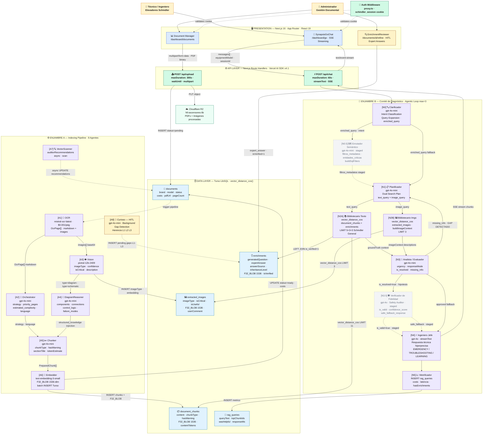

# Diagrama 1 — Lógico: Interacción entre Agentes y Flujo RAG

**Sistema:** Synapse MAS — RAG Multi-Agente para Diagnóstico Técnico de Elevadores Schindler
**Nivel:** Diseño lógico · Vista de componentes y flujos de datos
**Apto para:** Presentación en tesis, documentación técnica de arquitectura

---

## Finalidad

Mapa completo de interacción entre los dos enjambres del sistema. El **Enjambre A** transforma PDFs técnicos en conocimiento vectorial persistente. El **Enjambre B** recupera ese conocimiento en tiempo real y lo procesa en cadena para producir diagnósticos técnicos verificados y transmitidos por streaming al técnico.

---

## Diagrama



---

## Descripción por Capa

| Capa | Rol |
|---|---|
| **Presentation** | Next.js 16 con App Router: UI de chat (SSE streaming), gestión de documentos y revisión HITL del experto |
| **API Layer** | Route handlers de Next.js que orquestan ambos pipelines sobre Vercel Serverless |
| **Enjambre B** | Pipeline conversacional con agentic loop: cada iteración refina la búsqueda hasta que el contexto es suficiente o se alcanzan 3 loops |
| **Enjambre A** | Pipeline de indexación no bloqueante (`waitUntil`): convierte un PDF en chunks vectorizados y lanza el Curioso en background |
| **Data Layer** | Turso LibSQL con búsqueda vectorial nativa `vector_distance_cos()` sobre blobs `F32_BLOB(1536)` |

## Descripción por Componente — Enjambre B

| Nodo | Modelo | Responsabilidad |
|---|---|---|
| **[N0] Clarificador** | gpt-4o-mini | Clasifica el intent (`troubleshooting / education_info / emergency_protocol`) y expande la query con contexto del historial |
| **[N0.5] Enrutador Semántico** | gpt-4o-mini *(staged)* | Extrae entidades explícitas para construir filtros SQL precisos pre-retrieval. Reduce el espacio de búsqueda vectorial |
| **[N1] Planificador** | gpt-4o-mini | Genera un plan de búsqueda dual: `text_query` optimizada para fragmentos de texto y `image_query` para descripciones de esquemas |
| **[N2A] Bibliotecario Texto** | — | Ejecuta `vector_distance_cos` sobre `document_chunks` con `LEFT JOIN enrichments is_verified=1`. Devuelve hasta 11 fragmentos como `groundTruth` |
| **[N2B] Bibliotecario Imgs** | — | Ejecuta `vector_distance_cos` sobre `extracted_images`. Devuelve hasta 3 imágenes con sus descripciones como `imageContext` |
| **[N3] Analista / Evaluador** | gpt-4o-mini | Evalúa si el contexto acumulado es suficiente para diagnosticar. Si no: define el `missing_info` (gap) y regresa al Planificador. Si sí: aprueba y pasa al siguiente nodo |
| **[N3.5] Verificador de Fidelidad** | gpt-4o *(staged)* | Auditor de seguridad estricto. Contrasta la hipótesis del Analista contra la fuente RAG. Si algún dato técnico no está respaldado: `is_valid=false` y emite `safe_fallback_response` |
| **[N4] Ingeniero Jefe** | gpt-4o | Genera la respuesta técnica final en modo streaming SSE. Adapta el tono según `responseMode`: EMERGENCY, TROUBLESHOOTING, LEARNING o DEEP_ANALYSIS |
| **[N5] Metrificador** | — | Persiste la sesión en `rag_queries` con métricas de costo, latencia, chunks usados e indicadores de calidad |

## Descripción por Componente — Enjambre A

| Nodo | Modelo | Responsabilidad |
|---|---|---|
| **[A1] OCR** | mistral-ocr-latest | Extrae texto e imágenes rasterizadas del PDF. Produce `OcrPage[]` con markdown por página a $0.001/pág |
| **[A2] Orchestrator** | gpt-4o-mini | Analiza las 2 primeras páginas y decide la estrategia: `text_heavy / image_heavy / balanced`, `priority_pages` e idioma |
| **[A3] Vision** | pixtral-12b-2409 | Clasifica cada imagen: `imageType`, `confidence`, `isCritical`, `description` libre. Solo procesa imágenes no descartadas |
| **[A4] DiagramReasoner** | gpt-4o-mini | Se activa cuando Vision detecta `diagram` o `schematic`. Produce conocimiento estructurado: componentes, conexiones, lógica de control y modos de fallo. Se inyecta en el markdown del Chunker |
| **[A5] Chunker** | gpt-4o-mini | Segmentación semántica del texto de todas las páginas. Produce chunks con `chunkType`, `hasWarning`, `sectionTitle` y `tokenEstimate` |
| **[A6] Embedder** | text-embedding-3-small | Vectoriza cada chunk. Inserta en `document_chunks` como `F32_BLOB(1536)`. Actualiza `status=ready` al completar |
| **[A7] VectorScanner** | — | Escanea de forma asíncrona la base vectorial y genera `auditorRecommendations` para el dashboard |
| **[A8] Curioso** | gpt-4o-mini | Corre en background tras `status=ready`. Detecta lagunas de conocimiento y aplica herencia en cascada L1 (exacto) → L2 (modelo) → L3 (semántico) antes de crear una nueva pregunta HITL |

## Flujo Principal del Sistema

```
[INDEXACIÓN]
Administrador sube PDF
  → waitUntil desacopla respuesta HTTP del pipeline
  → OCR extrae texto e imágenes
  → Orchestrator decide estrategia
  → Vision clasifica imágenes (paralelo con Chunker)
    → DiagramReasoner enriquece diagramas con knowledge graph
  → Chunker segmenta el texto con metadata semántica
  → Embedder vectoriza y persiste en Turso (status=ready)
  → Curioso detecta lagunas y genera preguntas HITL en background
  → Experto responde en EnrichmentReviewer (isVerified=1)

[CONSULTA RAG]
Técnico envía consulta
  → Clarificador expande query y clasifica intent
  → Planificador genera plan de búsqueda dual
  → Bibliotecarios recuperan chunks e imágenes en paralelo
  → Analista evalúa suficiencia del contexto
    → Si insuficiente: define gap → regresa al Planificador (max 3x)
    → Si suficiente: aprueba hipótesis
  → [Verificador audita fidelidad contra fuente RAG - staged]
  → Ingeniero Jefe transmite respuesta técnica por SSE
  → Metrificador persiste sesión
```

---

> **Nota sobre componentes staged:** El Enrutador Semántico (`lib/agents/semantic_router.ts`) y el Verificador de Fidelidad (`lib/agents/verifier.ts`) están implementados y testeados pero pendientes de integración en `app/api/chat/route.ts`. Se muestran con borde discontinuo en el diagrama.
