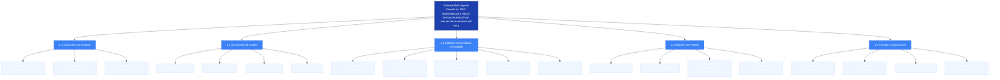

# Estructura de Desglose de Trabajo (EDT / WBS)

A continuación se presenta el mapa conceptual del proyecto siguiendo la estructura jerárquica solicitada.

```mermaid
graph TD
    %% Estilos Generales
    classDef default fill:#f9f9f9,stroke:#333,stroke-width:1px;
    classDef root fill:#1e40af,color:#fff,stroke:#1e3a8a,stroke-width:2px;
    classDef phase fill:#3b82f6,color:#fff,stroke:#2563eb,stroke-width:1px;
    classDef task fill:#eff6ff,stroke:#bfdbfe,stroke-width:1px;

    %% Nodos Principales
    ROOT["Sistema Multi-Agente basado en RAG MultiModal para reducir tiempo de atención en averías de ascensores del Perú"]
    
    1.1["1.1 Documento de Análisis"]
    1.2["1.2 Documento de Diseño"]
    1.3["1.3 Software Desarrollado e Instalado"]
    1.4["1.4 Reportes de Prueba"]
    1.5["1.5 Entrega a Operaciones"]

    %% Conexiones Raíz
    ROOT --> 1.1
    ROOT --> 1.2
    ROOT --> 1.3
    ROOT --> 1.4
    ROOT --> 1.5

    %% 1.1 Análisis
    1.1 --> 1.1.1["1.1.1 Especificación Funcional"]
    1.1 --> 1.1.2["1.1.2 Requerimientos Funcionales"]
    1.1 --> 1.1.3["1.1.3 Requerimientos No Funcionales"]

    %% 1.2 Diseño
    1.2 --> 1.2.1["1.2.1 Diseño Funcional"]
    1.2 --> 1.2.2["1.2.2 Diseño Técnico"]
    1.2 --> 1.2.3["1.2.3 Casos de Prueba"]
    1.2 --> 1.2.4["1.2.4 Planificación"]

    %% 1.3 Software
    1.3 --> 1.3.1["1.3.1 Ambiente de Desarrollo"]
    1.3 --> 1.3.2["1.3.2 Módulo de Indexación Asíncrona (5 Agentes)"]
    1.3 --> 1.3.3["1.3.3 Módulo Conversacional RAG (6 Agentes)"]
    1.3 --> 1.3.4["1.3.4 Módulo de Control y Validación (HITL)"]
    1.3 --> 1.3.5["1.3.5 Módulo de Telemetría y FinOps"]

    %% 1.4 Pruebas
    1.4 --> 1.4.1["1.4.1 Ambiente de Pruebas"]
    1.4 --> 1.4.2["1.4.2 Pruebas Integrales"]
    1.4 --> 1.4.3["1.4.3 Pruebas de Aceptación de Usuario (UAT)"]
    1.4 --> 1.4.4["1.4.4 Verificaciones Técnicas"]

    %% 1.5 Entrega
    1.5 --> 1.5.1["1.5.1 Reporte de Puesta en Producción"]
    1.5 --> 1.5.2["1.5.2 Pruebas Posproducción"]
    1.5 --> 1.5.3["1.5.3 Manuales de Usuario"]
    1.5 --> 1.5.4["1.5.4 Acta de Cierre de Proyecto"]

    %% Aplicar Estilos
    class ROOT root;
    class 1.1,1.2,1.3,1.4,1.5 phase;
    class 1.1.1,1.1.2,1.1.3,1.2.1,1.2.2,1.2.3,1.2.4,1.3.1,1.3.2,1.3.3,1.3.4,1.3.5,1.4.1,1.4.2,1.4.3,1.4.4,1.5.1,1.5.2,1.5.3,1.5.4 task;
```
